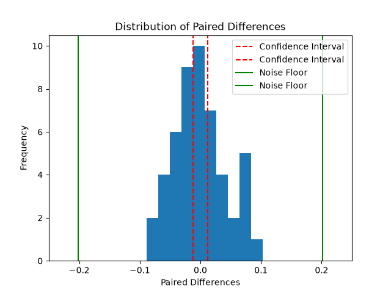

# Experimental design
## Hypothesis
Random training data sets inflates linear regression model performance for pChembl relative to a scaffold-based split data set. 
> Note: drafted during commit f168b82 2026-08-27, edits made after incur corrections
## Tested Descriptors
Target will be CHEMBL240, with data extracted from CHEMBL 37
5 descriptors will be:
- MW ([Molecular Weight] Greater contact surface typically allows for greater potency)
- CLogP ([Calculated logP] Binding tends to work through hydrophobic interactions)
- TPSA ([Topological Polar Surface Area] A greater TPSA is an indicator of solubility and hydrophilic interactions, which may work against binding)
- HBD ([Hydrogen Bond Donor count] More N-H and O-H groups allows for binding)
- Rotatable Bonds (Entropy creates friction for high flexibility molecules to bind)

> Note: a 5 descriptor linear regression is expected to be a weak indicator for trends across drug-like chemistry, for that reason, this experiment relates specifically to a comparison in behaviour rather than a direct affinity score.
## Scaffold Framework
The core molecular backbone will be determined via Bemis-Murcko framework (Murcko Scaffold).
## Test set and Repeats
> Data will utilise random seeds for both distribution and repeats

The data will be split into 80% training data, 20% testing data. 
50 repeats will be performed 
## Success Metrics
Gaps below the noise floor of 0.202 log units will be noted as uninterpretable (See Duplicate Removal for explanation).

To accurately assess the model's performance, MAE was chosen as the success evaluation metric. 
## Statistical Analysis
An alpha of 0.05, corresponding to a 95% will be utilised as the width of the paired interval.
A MAE paired interval between the random and scaffold split will determine the model's accuracy.

# Filter
## Records (row-level)
- 41,078 bioactivity entries
- 32,640 binding assay entries (assay_type = 'B')
- 16,198 entries which utilised IC50
- 10,228 entries which found IC50 within the tested concentrations
- 10,219 entries which report values in nM
- 10,000 after removing entries with data validity comments
- 8,941 after removing ChEMBL-flagged potential duplicates
- 8,901 after record-level deduplication (same parent, assay, document, and value)
- 8,901 after confidence score >= 8 (no entries removed for this target)

## Compounds (unique parents)
- 8,202 unique parent compounds
- 8,138 after removing 64 parents with per-parent SD > 0.96 log units (see Spread Filter)
- 8,136 with parseable molecular structures (CHEMBL5869391 and CHEMBL5784130 had no structure)

## Scaffolds
From 8,136 compounds, 4,187 scaffolds were found; 3,014 compounds had a unique scaffold (36.76%), meaning that 1,173 scaffolds were repeated across multiple compounds.

Compounds with no scaffold were dropped as they cannot be parsed.

# Methods
## P Value
> Note: Outcome values were computed and inspected for curation, but were never measured against any predictor
Concentrations above -3 (log) were discarded after looking at the data, decision was formulated with basis on the normal screening cutoff for inactive compounds. Results changed minimally (representing the removal of outlier testing):
> Note: Difference between distinct compounds
- median 5.3 -> 5.301 -> 5.300 (after validity comments filter)
- mean + 0.02 above median -> 0.196 above median (after filters)
- std 1.008 -> 0.976 -> 0.950 (after removal of duplicates) -> 0.933 (after validity comments filter)

### Duplicate Removal
Standard deviation across the same parent molecule was analysed, multiple duplicates skewed standard deviation towards 0. Duplicates were filtered through filtering out Potential Duplicates marked by Chembl and by filtering out data which contained same Parent Molecule ID, Assay ID, Document ID, and Standard Value.
> Note: Utilising the 4 filtering parameters allows some probable duplicate data in the system, but reduces the probability that genuine data is lost. There are still 40 entries (out of 8,304) which contain the exact same Standard Value, though they are not necessarily duplicates.

Standard deviation within same parent molecule (spread) was found to be 0.202, which was determined as the noise floor.

## Confidence Filter
A confidence filter with a threshold of >=8 was analysed, though no assay for this target scores below 8. After curation 19 assay ids were matched with a confidence level of 8, and 1,339 were matched with a confidence level of 9. No data would have been removed as a result of the filter as nothing scores below 8.

## Spread Filter
Dropped parent ids whose per-parent sample SD of pChEMBL values exceeds 0.96 log units (2 standard deviations of a single IC50 measurement error, sigma = 0.48, derived from sigma_diff = 0.68 / sqrt(2); Kalliokoski et al., 2013).

- 490 parent ids carried repeat measurements 
- 64 parent ids exceeded the cutoff and were dropped
- 426 parent ids with repeat measurements were retained

## Model
Parent molecules with repeated pChEMBL values will be evaluated as means for the model as obvious outliers should have been suppressed by filters.

### Limitations
- Scaffold split training data may exceed 80%, as scaffold groups are assigned together. Random split training data is not able to exceed 80%.

- Noise floor is a reflection of assay measurement precision, not a property of the split comparison, as utilised by Kalliokoski et al. (2013).

# Results and Conclusion
The scaffold split demonstrated a mean absolute error (MAE) of 0.624 +-0.040.
The random split demonstrated a MAE of 0.623 +- 0.012

The mean paired difference between these two groups was calculated as 0.0002 +- 0.043. Based on the proposed alpha of 0.05, the confidence interval of 50 runs (with standard seeds) was found to be 0.0124, compared to the noise floor of 0.202. Meaning that the difference in analysing hERG splits randomly or via scaffold grouping is not significant.

# References
Kalliokoski, T., Kramer, C., Vulpetti, A., & Gedeck, P. (2013). Comparability of mixed IC50 data – a statistical analysis. *PLoS ONE, 8*(4), e61007. https://doi.org/10.1371/journal.pone.0061007

# Repo Map
| File     | Purpose  | 
|----------|----------|
| experiment.py          | Main script, running and testing the hypothesis through data. Amount of runs can be altered                  | 
| function.py            | Contains functions to filter data, calculate noise floor, and scaffold structures                            |
| linear_regression.py   | Contains functions to calculate the linear regression of both scaffold split and the random split data       |
| pull.py                | Data import script for molecule data, creates activity and confidence csvs                                   |
| linear_descriptors.py  | Data import script for the descriptors, creates descriptor csv                                               |
| explore.py             | Script utilised for exploratory purposes, served to analyse the data and create the necessary filters        | 
| scaffold.py            | Exploratory script utilised to analyse scaffold structures                                                   |